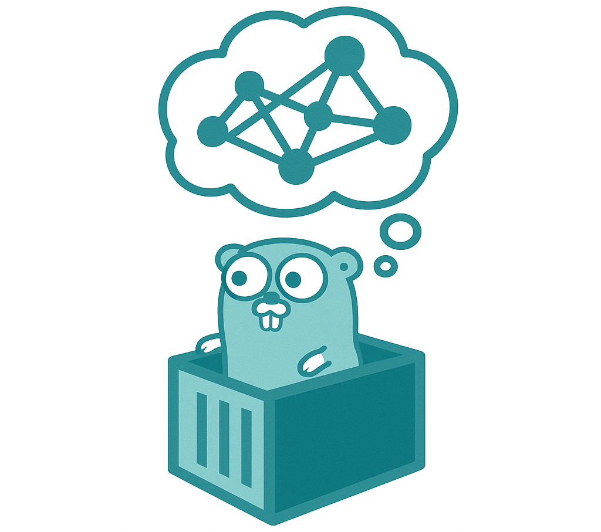

[](https://opensource.org/licenses/Apache-2.0)
[](https://pkg.go.dev/github.com/NVIDIA/gontainer)

[](https://goreportcard.com/report/github.com/NVIDIA/gontainer)

# Gontainer

Dependency injection service container for Golang projects.
<p align="center"></p>

## Features

- 🚀 Eager services instantiation with automatic dependencies resolution and optional dependencies support.
- 🛠 Dependency Injection for service factories, avoiding manual fetch through container API.
- 🔄 Reverse-to-Instantiation order for service termination to ensure proper resource release and shutdown.
- 📣 Events broker for inter-service container-wide communications.
- 🤖 Clean, tested and with small codebase based on reflection.

## Examples

* [Basic script example](./examples/01_basic_usage/main.go) showing how to do something useful and then exit.
* [Daemon service example](./examples/02_daemon_service/main.go) showing how to launch background services.

## Quick Start

1. Define an example service object.
    ```go
    // MyService performs some crucial tasks.
    type MyService struct{}

    // SayHello outputs a friendly greeting.
    func (s *MyService) SayHello(name string) {
	    log.Println("Hello,", name)
    }
   ```
2. Define a service factory.
   ```go
   func NewMyService() *MyService {
      return new(MyService)
   }
   ```
3. Register service factories in the container.
   ```go
   container, err := gontainer.New(
      // Define MyService factory in the container.
      gontainer.NewFactory(NewMyService),
   
      // Here we can define another services depending on `*MyService`.
      // All dependencies are declared using factory function args.
      gontainer.NewFactory(func(service *MyService) {
         service.SayHello("Username")
      }),
   )
   if err != nil {
      log.Fatalf("Failed to init service container: %s", err)
   }
   ```
5. Start the container and launch all factories.
   ```go
   if err := container.Start(); err != nil {
      log.Fatalf("Failed to start service container: %s", err)
   }
   ```

## Key Concepts

### Service Factories

The **Service Factory** is a key component of the service container, serving as a mechanism for creating service instances.
A **Service Factory** is essentially a function that accepts another services and returns an instances of services of concrete types or an
interfaces and optionally spawn an error in the last return argument. Using service factory signature, the service container
will resolve and spawn all dependency services using reflection and fail, if there are unresolvable dependencies.

```go
// MyServiceFactory is an example of a service factory.
func MyServiceFactory( /* service dependencies */) *MyService {
   // Initialize service instance.
   return new(MyService)
}

// MyServiceFactory depends on two services.
func MyServiceFactory(svc1 MyService1, svc2 MyService2) MyService {...}

// MyServiceFactory optionally depends on the service.
func MyServiceFactory(optSvc1 gontainer.Optional[MyService1]) {...}

// MyServiceFactory provides two services.
func MyServiceFactory() (MyService1, MyService2) {...}

// MyServiceFactory provides two services and spawn error.
func MyServiceFactory() (MyService1, MyService2, error) {...}

// MyServiceFactory provides no services an error.
func MyServiceFactory() error {...}

// MyServiceFactory provides nothing. Sic!
func MyServiceFactory() {...}
```

The factory function's role is to perform any necessary initializations and return a fully-configured service instance
to the container.

There are two predefined by container service types that may be used as a dependencies in the factory arguments.

1. The `context.Context` service provides the per-service context, inherited from the root app context.
   This context is cancelled right before the service's `Close()` call and intended to be used with service functions.
1. The `gontainer.Events` service provides the events broker. It can be used to send and receive events
   inside service container between services or outside from the client code.

### Services

A service is a functional component of the application, created and managed by a Service Factory. 
The lifetime of a service is tied to the lifetime of the entire container.

A service may optionally implement a `Close() error` method, which is called when the container is shutting down.

```go
// MyService defines example service.
type MyService struct {}

// SayHello is service domain method example. 
func (s *MyService) SayHello(name string) {
    fmt.Println("Hello,", name)
}

// Close is an optional method called from container's Close(). 
func (s *MyService) Close() error {
   // Synchronous cleanup logic here.
   return nil
}
```

### Service Functions

The **Service Function** is a specialized form of service optimized for simpler tasks. Instead of returning an concrete
type object or an interface, the service factory returns a function that conforms to `func() error` type.

The function serves two primary roles:

- It encapsulates the behavior to execute when the container starts asynchronously to the `Start()` method.
- It returns an error, which is treated as if it were returned by a conventional `Close()` method.

```go
// MyServiceFactory is an example of a service function usage.
func MyServiceFactory(ctx context.Context) func () error {
   return func () error {
      // Await its order in container close.
      <-ctx.Done()
      
      // Return nil from the `service.Close()`.
      return nil
   }
}
```

In this design, the factory function is responsible for receiving the context. This context is canceled when the service
needs to close, allowing the function to terminate gracefully.

Errors returned by the function are processed as if they were errors returned by a standard `Close()` method to the container.

### Events Broker

The **Events Broker** is an additional part of the service container architecture. It facilitates communication between services
without them having to be directly aware of each other. The Events Broker works on a publisher-subscriber model, enabling services
to publish events to, and subscribe to events from, a centralized broker.

This mechanism allows services to remain decoupled while still being able to interact through a centralized medium.
In particular, the `gontainer.Events` service provides an interface to the events broker and can be injected as a dependency in any service factory.
Even more, subscription is working before `container.Start()` with the `gontainer.WithSubscribe()` option, e.g. it can be used for config validation.

#### Builtin events

1. **ContainerStarting**: produced when container start method invoked. Synchronous.
1. **ContainerStarted**: produced when container start method finished. Synchronous.
1. **ContainerClosing**: produced when container close method invoked. Synchronous.
1. **ContainerClosed**: produced when container close method finished. Synchronous.
1. **UnhandledPanic**: produced when the panic is happened on container init, start or close.

### Container Lifecycle

1. **New**: The container is instantiated, and the reflection parsing of service factories is completed. The container ensures that service dependencies are resolved.
1. **Subscription**: Factories may subscribe to the corresponding events via the Events Broker.
1. **Start**: Service factories are called to instantiate all service instances in container.
1. **Runtime**: The container, along with all its services, are now fully operational.
1. **Termination**: Upon receiving a close call or event, the container will invoke the `Close()` method on each service that has one, in the reverse order of their initialization.
1. **Closed**: The container is fully terminated, and all resources have been released.
