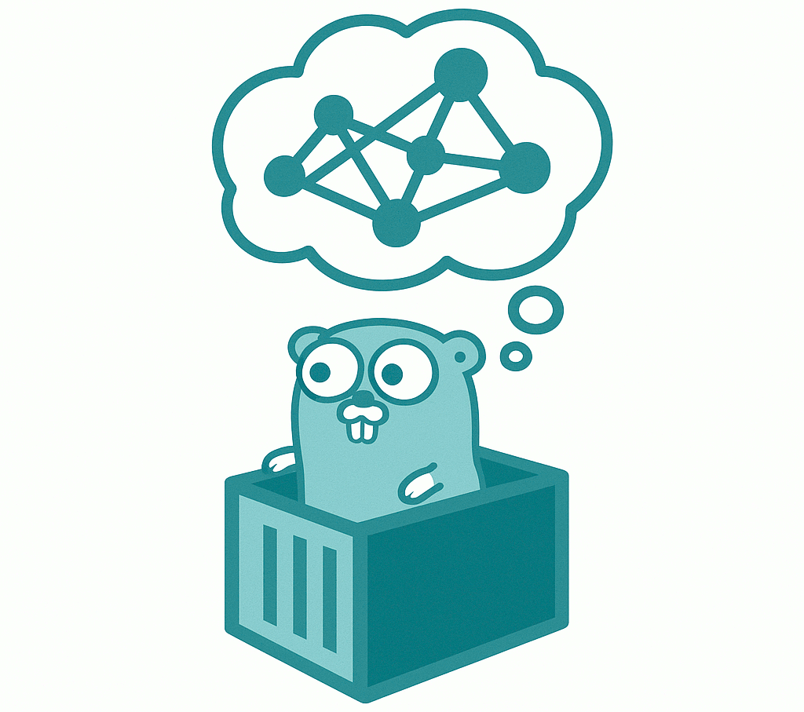

[](https://opensource.org/licenses/Apache-2.0)
[](https://pkg.go.dev/github.com/NVIDIA/gontainer/v2)

[](https://goreportcard.com/report/github.com/NVIDIA/gontainer/v2)

# Gontainer

Simple but powerful dependency injection container for Go projects!

<p align="center"></p>

## Features

- 🎯 Automatic dependency injection based on function signatures.
- ✨ Super simple interface to register and run services.
- 🚀 Lazy service creation only when actually needed.
- 🔄 Lifecycle management with proper cleanup in reverse order.
- 🤖 Clean and tested implementation using reflection and generics.
- 🧩 No external packages, no code generation, zero dependencies.

## Quick Start

The example shows how to build the simplest app using service container.

```go
package main

import (
    "log"
    "github.com/NVIDIA/gontainer/v2"
)

// Your services.
type Database struct{ connString string }
type UserService struct{ db *Database }

func main() {
    err := gontainer.Run(
        // Register Database.
        gontainer.NewFactory(func() *Database {
            return &Database{connString: "postgres://localhost/myapp"}
        }),
        
        // Register UserService - Database is auto-injected!
        gontainer.NewFactory(func(db *Database) *UserService {
            return &UserService{db: db}
        }),
        
        // Use your services.
        gontainer.NewEntrypoint(func(users *UserService) {
            log.Printf("UserService ready with DB: %s", users.db)
        }),
    )
    
    if err != nil {
        log.Fatal(err)
    }
}
```

## Examples

* [Console command example](./examples/01_console_command/main.go) – demonstrates how to build a simple console command.
  ```
  12:51:32 Executing service container
  12:51:32 Hello from the Hello Service Bob
  12:51:32 Service container executed
  ```
* [Daemon service example](./examples/02_daemon_service/main.go) – demonstrates how to maintain background services.
  ```
  12:48:22 Executing service container
  12:48:22 Starting listening on: http://127.0.0.1:8080
  12:48:22 Starting serving HTTP requests
  ------ Application was started and now accepts HTTP requests -------------
  ------ CTRL+C was pressed or a TERM signal was sent to the process -------
  12:48:28 Exiting from serving by signal
  12:48:28 Service container executed
  ```
* [Complete webapp example](./examples/03_complete_webapp/main.go) – demonstrates how to organize web application with multiple services.
  ```
  15:19:48 INFO msg="Starting service container" service=logger
  15:19:48 INFO msg="Configuring app endpoints" service=app
  15:19:48 INFO msg="Configuring health endpoints" service=app
  15:19:48 INFO msg="Starting HTTP server" service=http address=127.0.0.1:8080
  ------ Application was started and now accepts HTTP requests -------------
  15:19:54 INFO msg="Serving home page" service=app remote-addr=127.0.0.1:62640
  15:20:01 INFO msg="Serving health check" service=app remote-addr=127.0.0.1:62640
  ------ CTRL+C was pressed or a TERM signal was sent to the process -------
  15:20:04 INFO msg="Terminating by signal" service=app
  15:20:04 INFO msg="Closing HTTP server" service=http
  ```
* [Transient service example](./examples/04_transient_services/main.go) – demonstrates how to return a function that can be called multiple times to produce transient services.
  ```
  11:19:22 Executing service container
  11:19:22 New value: 8767488676555705225
  11:19:22 New value: 5813207273458254863
  11:19:22 New value: 750077227530805093
  11:19:22 Service container executed
  ```

## Installation

```bash
go get github.com/NVIDIA/gontainer/v2
```

Requirements: Go 1.21+

## Core Concepts

### 1. Define Services

Services are just regular Go types:

```go
type EmailService struct {
    smtp string
}

func (s *EmailService) SendWelcome(email string) error {
    log.Printf("Sending welcome email to %s via %s", email, s.smtp)
    return nil
}
```

### 2. Register Factories

Factories create your services. Dependencies are declared as function parameters:

```go
// Simple factory.
gontainer.NewFactory(func() *EmailService {
    return &EmailService{smtp: "smtp.gmail.com"}
})

// Factory with dependencies - auto-injected!
gontainer.NewFactory(func(config *Config, logger *Logger) *EmailService {
    logger.Info("Creating email service")
    return &EmailService{smtp: config.SMTPHost}
})

// Factory with a cleanup callback.
gontainer.NewFactory(func() (*Database, func() error) {
    db, _ := sql.Open("postgres", "...")
    
    return db, func() error {
        log.Println("Closing database")
        return db.Close()
    }
})
```

### 3. Run Container

```go
err := gontainer.Run(
    gontainer.NewFactory(...),
    gontainer.NewFactory(...),
    gontainer.NewEntrypoint(func(/* dependencies */) {
        // application entry point
    }),
)
```

## Advanced Features

### Resource Cleanup

Return a cleanup function from your factory to handle graceful shutdown:

```go
gontainer.NewFactory(func() (*Server, func() error) {
    server := &http.Server{Addr: ":8080"}
    go server.ListenAndServe()
    
    // Cleanup function called on container shutdown.
    return server, func() error {
        ctx, cancel := context.WithTimeout(context.Background(), 30*time.Second)
        defer cancel()
        return server.Shutdown(ctx)
    }
})
```

### Optional Dependencies

Use when a service might not be registered:

```go
gontainer.NewFactory(func(metrics gontainer.Optional[*MetricsService]) *API {
    api := &API{}
    
    // Use metrics if available
    if m := metrics.Get(); m != nil {
        api.metrics = m
    }
    
    return api
})
```

### Multiple Dependencies

Get all services implementing an interface:

```go
type Middleware interface {
    Process(http.Handler) http.Handler
}

gontainer.NewFactory(func(middlewares gontainer.Multiple[Middleware]) *Router {
    router := &Router{}
    for _, mw := range middlewares {
        router.Use(mw)
    }
    return router
})
```

### Dynamic Resolution

Resolve services on-demand:

```go
gontainer.NewEntrypoint(func(resolver *gontainer.Resolver) error {
    // Resolve service dynamically.
    var userService *UserService
    if err := resolver.Resolve(&userService); err != nil {
        return err
    }
    
    return userService.DoWork()
})
```

### Transient Services

Create new instances on each call:

```go
// Factory returns a function that creates new instances.
gontainer.NewFactory(func(db *Database) func() *Transaction {
    return func() *Transaction {
        return &Transaction{
            id: uuid.New(),
            db: db,
        }
    }
})

// Use the factory function.
gontainer.NewEntrypoint(func(newTx func() *Transaction) {
    tx1 := newTx()  // new instance
    tx2 := newTx()  // another new instance
})
```

### Factory Annotations

Attach arbitrary metadata to a factory or entrypoint with `WithAnnotation`.
Annotations are exposed via `Factory.Annotations()` / `Entrypoint.Annotations()`
and can be read **without starting the container** - useful for `--help`,
config validation, CLI dispatch, or any pre-run tooling built on top of the
same factory definitions.

```go
type cliHelp struct {
    Cmd string
    Doc string
}

configFactory := gontainer.NewFactory(
    newConfig,
    gontainer.WithAnnotation(cliHelp{Cmd: "config", Doc: "Print resolved config"}),
)

dbFactory := gontainer.NewFactory(
    newDatabase,
    gontainer.WithAnnotation(cliHelp{Cmd: "db", Doc: "Ping the database"}),
)

// Inspect annotations without starting the container.
for _, f := range []*gontainer.Factory{configFactory, dbFactory} {
    for _, a := range f.Annotations() {
        if h, ok := a.(cliHelp); ok {
            fmt.Printf("%s\t%s\n", h.Cmd, h.Doc)
        }
    }
}

// Start the container with the same factories when ready.
_ = gontainer.Run(configFactory, dbFactory, entrypoint)
```

## API Reference

### Module Functions

Gontainer module interface is really simple:

```go
// Run creates and runs a container with provided factories and entrypoints.
func Run(options ...Option) error

// NewFactory registers a service factory.
func NewFactory(fn any) *Factory

// NewService registers a pre-created service.
func NewService[T any](service T) *Factory

// NewEntrypoint registers an entrypoint function.
func NewEntrypoint(fn any) *Entrypoint
```

### Factory Signatures

**Factory** is a function that creates one service. It can have dependencies as parameters,
and can optionally return an error and/or a cleanup function for the factory.

**Dependencies** are other services that the factory needs which are automatically injected.

**Service** is a user-provided type. It can be any type except untyped `any` and `error`.


```go
// The simplest factory.
func() *Service

// Factory with dependencies.
func(dep1 *Dep1, dep2 *Dep2) *Service

// Factory with error.
func() (*Service, error)

// Factory with cleanup.
func() (*Service, func() error)

// Factory with cleanup and error.
func() (*Service, func() error, error)
```

### Built-in Services

Gontainer provides several built-in services that can be injected into factories and functions.
They provide access to container features like dynamic resolution and invocation.

```go
// *gontainer.Resolver - Dynamic service resolution.
func(resolver *gontainer.Resolver) *Service

// *gontainer.Invoker - Dynamic function invocation.
func(invoker *gontainer.Invoker) *Service
```

### Special Types

Gontainer provides special types for declaring optional and multiple
dependencies in factory and entrypoint signatures. See
[Optional Dependencies](#optional-dependencies) and
[Multiple Dependencies](#multiple-dependencies) for full examples.

```go
// Optional[T] - declares a dependency that may be absent from the container.
// Call .Get() to read the value; the zero value of T is returned when no
// matching factory is registered.
func(logger gontainer.Optional[*Logger]) *Service

// Multiple[T] - declares a dependency on all services assignable to T.
// Range over the slice to access each registered service.
func(providers gontainer.Multiple[AuthProvider]) *Router
```

## Error Handling

Gontainer provides typed errors for different failure scenarios:

```go
err := gontainer.Run(factories...)

switch {
case errors.Is(err, gontainer.ErrFactoryReturnedError):
    // Factory returned an error.
case errors.Is(err, gontainer.ErrEntrypointReturnedError):
    // Entrypoint returned an error.
case errors.Is(err, gontainer.ErrNoEntrypointsProvided):
    // No entrypoints were provided.
case errors.Is(err, gontainer.ErrCircularDependency):
    // Circular dependency detected.
case errors.Is(err, gontainer.ErrDependencyNotResolved):
    // Service type not registered.
case errors.Is(err, gontainer.ErrFactoryTypeDuplicated):
    // Service type was duplicated.
}
```

## Contributing

We welcome contributions! Please see [CONTRIBUTING.md](CONTRIBUTING.md) for guidelines.

## License

Apache 2.0 – See [LICENSE](LICENSE) for details.

## Documentation for `v1`

Documentation for the previous major version `v1` is available at [v1 branch](https://github.com/NVIDIA/gontainer/tree/v1).
