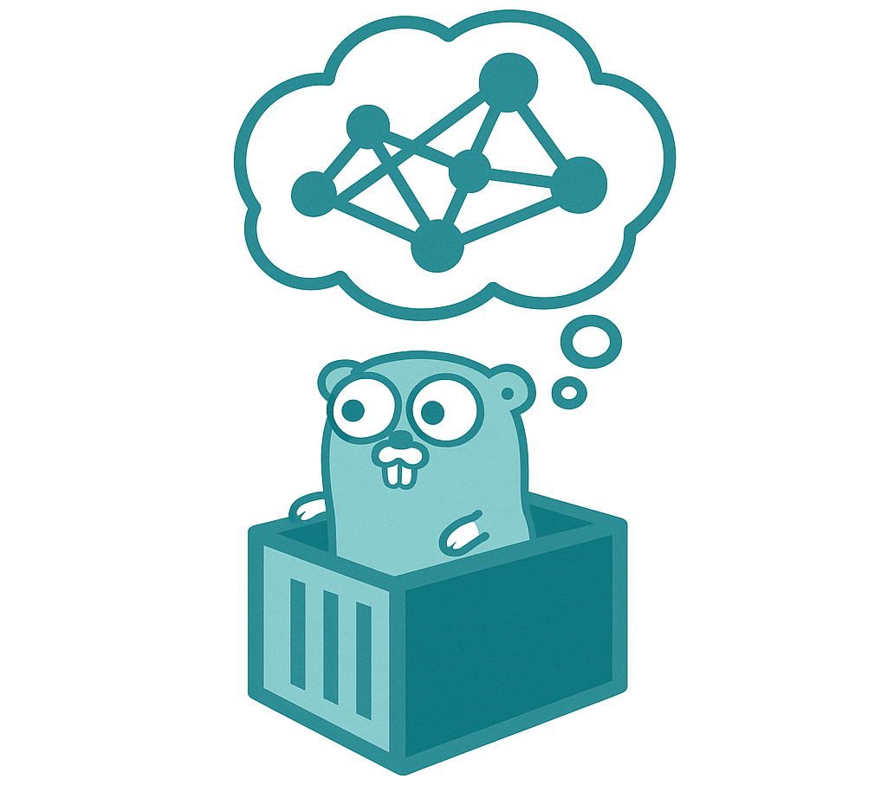

[](https://opensource.org/licenses/Apache-2.0)
[](https://pkg.go.dev/github.com/NVIDIA/gontainer)

[](https://goreportcard.com/report/github.com/NVIDIA/gontainer)

# Gontainer

Dependency injection service container for Golang projects.
<p align="center"></p>

## Features

- 🚀 Eager or lazy services instantiation with automatic dependencies resolution and optional dependencies support.
- 🛠 Automatic injection of dependencies for service factories, avoiding manual fetch through container API.
- 🔄 Automatic reverse-to-instantiation order for service termination to ensure proper resource release and shutdown.
- 🤖 Clean and tested implementation based on reflection and generics. No external dependencies.

## Examples

* [Console command example](./examples/01_console_command/main.go) – demonstrates how to build a simple console command. It shows how to use `Resolver` and `Invoker` services to organize the application entry point in a run-and-exit style.
  ```
  12:51:32 Executing service container
  12:51:32 Hello from the Hello Service Bob
  12:51:32 Service container executed
  ```
* [Daemon service example](./examples/02_daemon_service/main.go) – demonstrates how to maintain background services. It shows how to organize a daemon entry point and wait for graceful shutdown by subscribing to OS termination signals.
  ```
  12:48:22 Executing service container
  12:48:22 Starting listening on: http://127.0.0.1:8080
  12:48:22 Starting serving HTTP requests
  ------ Application was started and now accepts HTTP requests -------------
  ------ CTRL+C was pressed or a TERM signal was sent to the process -------
  12:48:28 Exiting from serving by signal
  12:48:28 Service container executed
  ```
* [Complete webapp example](./examples/03_complete_webapp/main.go) – demonstrates how to organize web application with multiple services. It provides basic config service, handles logging, setups HTTP server and initiates two endpoints.
  ```
  15:19:48 INFO msg="Starting service container" service=logger
  15:19:48 INFO msg="Configuring app endpoints" service=app
  15:19:48 INFO msg="Configuring health endpoints" service=app
  15:19:48 INFO msg="Starting HTTP server" service=http address=127.0.0.1:8080
  ------ Application was started and now accepts HTTP requests -------------
  15:19:54 INFO msg="Serving home page" service=app remote-addr=127.0.0.1:62640
  15:20:01 INFO msg="Serving health check" service=app remote-addr=127.0.0.1:62640
  ------ CTRL+C was pressed or a TERM signal was sent to the process -------
  15:20:04 INFO msg="Terminating by signal" service=app
  15:20:04 INFO msg="Closing HTTP server" service=http
  ```
* [Transient service example](./examples/04_transient_services/main.go) – demonstrates how to return a function that can be called multiple times to produce transient services.
  ```
  11:19:22 Executing service container
  11:19:22 New value: 8767488676555705225
  11:19:22 New value: 5813207273458254863
  11:19:22 New value: 750077227530805093
  11:19:22 Service container executed
  ```

## Quick Start

1. Define an example service.
    ```go
    // MyService performs some crucial tasks.
    type MyService struct{}

    // SayHello outputs a friendly greeting.
    func (s *MyService) SayHello(name string) {
        log.Println("Hello,", name)
    }
   ```
2. Define a service factory.
   ```go
   func NewMyService() *MyService {
      return new(MyService)
   }
   ```
3. Run the container with service factories.
   ```go
   err := gontainer.Run(
      context.Background(),

      // Define MyService factory in the container.
      gontainer.NewFactory(NewMyService),
   
      // Here we can define additional services depending on `*MyService`.
      // All dependencies are declared using factory function args.
      gontainer.NewFactory(func(service *MyService) {
         service.SayHello("Username")
      }),
   )
   if err != nil {
      log.Fatalf("Failed to run service container: %s", err)
   }
   ```
4. For on-demand resolution there are `Resolver` and `Invoker` services.
   ```go
   err := gontainer.Run(
      context.Background(),

      // Define MyService factory.
      gontainer.NewFactory(NewMyService),
   
      // Use Resolver to resolve services on-demand.
      gontainer.NewFunction(func(resolver *gontainer.Resolver) error {
         var myService *MyService
         if err := resolver.Resolve(&myService); err != nil {
             return err
         }
         myService.SayHello("World")
         return nil
      }),
   )
   ```
   or
   ```go
   err := gontainer.Run(
      context.Background(),

      // Define MyService factory.
      gontainer.NewFactory(NewMyService),
   
      // Use Invoker to call functions with auto-injection.
      gontainer.NewFunction(func(invoker *gontainer.Invoker) error {
         values, err := invoker.Invoke(func(myService *MyService) error {
             myService.SayHello("World")
             return nil
         })
         if err != nil {
             return err
         }
         // Check function's returned error
         if values[0] != nil {
             return values[0].(error)
         }
         return nil
      }),
   )
   ```
   The `Resolver` and `Invoker` services can serve as an entry point to the application, especially when it's a simple console tool that runs a task and exits.
   The [console command example](./examples/01_console_command/main.go) demonstrates this approach.

## Key Concepts

### Service Factories

The **Service Factory** is a key component of the service container, serving as a mechanism for creating service instances.
A service factory is essentially a function that accepts other services as arguments and returns one service instance,
optionally along with an error. Using service factory signature, the service container will resolve and spawn all dependency
services using reflection and fail, if there are unresolvable dependencies.

```go
// MyServiceFactory depends on two services.
func MyServiceFactory(svc1 *MyService1, svc2 *MyService2) *MyService {...}

// MyServiceFactory returns a service with error handling.
func MyServiceFactory() (*MyService, error) {...}

// Invalid patterns - these will be rejected:
// func() (*Service1, *Service2) {...}         // Multiple outputs not allowed
// func() error {...}                          // Must return exactly one service
// func() {...}                                // Must return exactly one service
```

The factory function's role is to perform any necessary initializations and return a fully-configured service instance
to the container.

There are several predefined by container service types that may be used as a dependencies in the factory arguments.

1. The `context.Context` service provides the per-service context, inherited from the context passed to `New()`.
   This context is cancelled right before the service's `Close()` call.
2. The `*gontainer.Resolver` service provides a service to resolve dependencies dynamically. Thread safe.
3. The `*gontainer.Invoker` service provides a service to invoke functions dynamically. Thread safe.

#### Transient Service Factories

In the service container all factories are singletons by design: they are called exactly once (with the `container.Start()`)
or zero-or-once (without start but via `resolver.Resolve()` or `invoker.Invoke()` calls) times. But sometimes it is necessary
to create new service instance calling the factory multiple times, for example, to create a new service for each HTTP request.
To achieve this, the service factory can return a function (this function will be still in the single instance) that produces
a new service instance each time it is called and other factories could depend on this function by its type.

```go
err := gontainer.Run(
    context.Background(),

    // Return new function from the factory.
	// It will produce new values each time.
    gontainer.NewFactory(func() func() int {
        return func() int { 
			return rand.Int()
		}
    }),

    // Depend on the function returned from the first factory.
	// It will be called three times, producing three new values.
    gontainer.NewFunction(func(funcFromFactory1 func() int) {
        fmt.Println(funcFromFactory1())
        fmt.Println(funcFromFactory1())
        fmt.Println(funcFromFactory1())
    }),
)
```

#### Optional Dependency Declaration

The `gontainer.Optional[T]` type allows to depend on a type that may or may not be present.
For example, when developing a factory that uses a telemetry service, this type can be used if the service
is registered in the container. If the telemetry service is not registered, this is not considered an error,
and telemetry initialization can be skipped in the factory.

```go
// MyServiceFactory optionally depends on the service.
func MyServiceFactory(optService1 gontainer.Optional[MyService1]) {
    // Get will not produce any error if the MyService1 is not registered
    // in the container: it will return zero value for the service type.
    service := optSvc1.Get()
}
```

#### Multiple Dependencies Declaration

The `gontainer.Multiple[T]` type allows retrieval of all services that match the type `T`. This feature is 
intended to be used when providing concrete service types from multiple factories (e.g., struct pointers like
`*passwordauth.Provider`, `*tokenauth.Provider`) and depending on them as services `Multiple[IProvider]`.
In this case, the length of the `services` slice could be in the range `[0, N]`.

If a concrete non-interface type is specified in `T`, the slice can have at most one element. 
The container restricts the registration of the same non-interface type more than once.

```go
// MyServiceFactory depends on all services implementing the interface.
func MyServiceFactory(servicesSlice gontainer.Multiple[MyInterface]) {
    for _, service := range servicesSlice {
        service.DoSomething()
    }
}
```

### Services

A service is a functional component of the application, created and managed by a Service Factory. 
The lifetime of a service is tied to the lifetime of the entire container.

A service may optionally implement a `Close() error` or just `Close()` method, which is called when the container is shutting down.
The `Close` call is synchronous: remaining services will not be closed until this method returns.

```go
// MyService defines example service.
type MyService struct {}

// SayHello is service domain method example. 
func (s *MyService) SayHello(name string) {
    fmt.Println("Hello,", name)
}

// Close is an optional method called from container's Close(). 
func (s *MyService) Close() error {
   // Synchronous cleanup logic here.
   return nil
}
```

### Container API

The package provides the following main function:

```go
// Run runs the container with the given context and factories.
// It automatically handles the container lifecycle:
// 1. Registers all factories.
// 2. Validates dependencies.
// 3. Spawns all factories.
// 4. Closes all services.
func Run(ctx context.Context, factories ...*Factory) error
```

### Built-in Services

The container automatically provides the following services that can be injected into any factory:

```go
// Resolver provides on-demand service resolution.
type Resolver struct { ... }

// Resolve resolves a service dependency and stores it in the provided pointer.
// If the service is not yet instantiated, it will be created along with
// its transitive dependencies.
func (r *Resolver) Resolve(varPtr any) error

// Invoker provides dynamic function invocation with dependency injection.
type Invoker struct { ... }

// Invoke calls the provided function with auto-injected dependencies.
// Returns all values returned by the function as []any, and an error if
// dependency resolution fails. Services are instantiated on-demand.
func (i *Invoker) Invoke(fn any) ([]any, error)
```

### Container Errors

The service container may return the following errors, which can be checked using `errors.Is`:

| Error                      | Description                                                                     |
|----------------------------|---------------------------------------------------------------------------------|
| `ErrFactoryReturnedError`  | Occurs when the service factory returns an error during invocation.             |
| `ErrFunctionReturnedError` | Occurs when the container function returns an error during invocation.          |
| `ErrServiceNotResolved`    | Occurs when resolving a service fails due to an unregistered service type.      |
| `ErrServiceDuplicated`     | Occurs when a service type duplicate found during the initialization procedure. |
| `ErrCircularDependency`    | Occurs when a circular dependency found during the initialization procedure.    |
